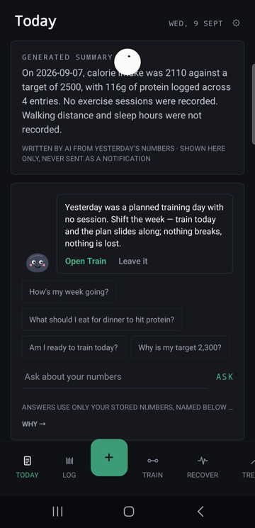
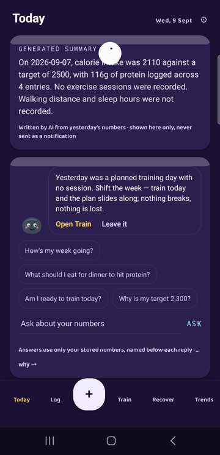
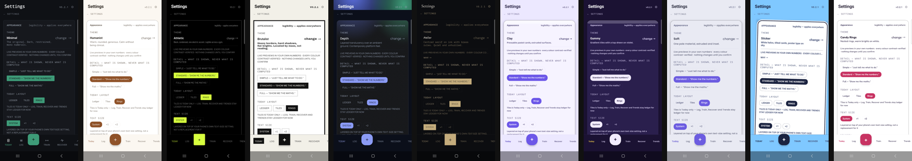

# Basalt

**A non-gamified, honesty-first health ledger for Android** — food, training,
sleep and vitals in one place, so the numbers can talk to each other. The
honesty laws in plain words: real data or a quiet empty state, never a
fabricated chart; every formula published; AI proposes and never narrates;
over-target is stated plainly ("41 / 36 g · 5 over") and never scolded;
every synced number shows its source; capture is never paywalled and manual
entry is always enough.

## What Basalt does and doesn't do

*The in-app promise, verbatim (Settings → About):*

**What it does**

- Builds your programme and meal plan from your own numbers — your equipment, your week, your history.
- Shows the maths behind every target, every suggestion, every adjustment. Nothing is a black box.
- Corrects itself weekly against your trend weight — one bounded change at a time, with the reason attached.

**What it doesn't**

- See your form. A phone can count sets; it cannot watch your spine.
- Tell muscle from fat on the scale. The trend is honest; its composition isn't knowable from here.
- Diagnose anything. Pain flags count; they never conclude.
- Replace a professional for injuries, eating disorders or medical conditions — those deserve a person.

Every formula in the app is printed next to its number. If you ever find
one that isn't, that's a bug — tell us.

## Screenshots

| Today — Minimal | Today — Gummy | Today — Simple detail |
|---|---|---|
|  |  |  |

## Themes

Eleven themes, one contract: every colour pair is contrast-verified in CI
(4.5:1 text, 3:1 marks — plus a rendered-tree contrast walker), so the
bubbly ones are exactly as legible as the stern ones. Motion is a token
too: Minimal snaps, Gummy springs, and Android's "Remove animations"
turns all of it off.



Minimal · Humanist · Athletic · Brutalist · Depth · Atelier · Clay ·
Gummy · Soft · Sticker · Candy Rings

## Extras

Everything beyond the core ledger is an **Extra**: off by default
(capture inputs excepted), one switch each, honest inside. With
everything off, Basalt is exactly the core app. This list is generated
from the registry the app compiles against, so it can't drift:

**Capture**

- **Photo to meal** · on by default — Point the camera at a plate — AI proposes items with portion ranges; you correct, then log.
- **Voice logging** · on by default — Say the meal — your phone transcribes on-device, the same proposal engine parses it.
- **Barcode & label scan** · on by default — Scan a barcode, or photograph the nutrition panel — uncertain reads come back as ranges.
- **Plate builder** · on by default — Drag your recent foods onto a plate and size the portions — commits as ordinary entries.

**Motivation**

- **Streaks** — Day runs for logging, training and sleep — two automatic freezes a week, rules published on Trends.
- **XP, levels & badges** — XP from real actions with the formula printed in-app; badges only for real milestones; confetti only on PRs.
- **Friends & challenges** — Invite-code friends, weekly challenges, leaderboards among friends only — aggregates, never your food.
- **Daily summary** — One AI-written paragraph about yesterday, from your real numbers — labelled as generated, never a notification.
- **Pebble grows** · needs pebble — Five stages from a published 30-day consistency score — regression is allowed and visible.
- **Pebble** — A quiet mascot that only speaks when there’s something to do.

**Glanceability**

- **Sounds** — Three short samples on set commit, log commit and a PR — off by default; haptics stay regardless.
- **Extra home-screen widgets** — Macros join the Today widget and a Readiness widget becomes available — system placements you add yourself.

**More tools**

- **Meal planning & grocery list** — A week plan from your recent foods against your macro gaps; the grocery list aggregates it.
- **Fasting timer** — Start and end fasts on Recover — elapsed time stated plainly, no coaching about hunger.
- **Hydration reminders** — Scheduled nudges to drink water, at hours you set — a reminder, never a guilt trip.
- **Supplements checklist** — Your own list, ticked per day — no products suggested, no doses proposed, ever.
- **Cycle tracking** — Log-only dates and symptoms; Trends shows a band and a published average-cycle estimate with its range.
- **Progress photos** — Side-by-side and overlay compare. Photos stay on this phone unless you flip cloud sync on, separately.
- **Programmes** — Template blocks with a weekly check-in that proposes exactly one thing — hold, one bounded step, or slow down.
- **Connected services** — Strava, Garmin and Oura imports with source attribution — sessions and sleep, never edited.

**Wellbeing tools**

- **Journal** — Free writing, on this phone only by default — cloud sync is a separate switch; a doctor-PDF export exists.
- **Wind-down** — Box breathing, a 5-minute body scan, a 10-minute quiet timer — offered when sleep debt runs high.
- **Meditation timer** — A quiet timer with an interval bell — minutes land in your ledger as sessions, nothing more.

**Basalt**

- **Visible uncertainty** · on by default — The day’s intake as a range that narrows as entries are weighed — per-source model published in-app.
- **Pebble Coach** · needs pebble — Ask about your own numbers — answers cite exactly what they used, propose at most one action, never edit anything.

## Detail levels

A third axis beside theme and layout: **Simple** ("Just tell me what to
do.") · **Standard** ("Show me the numbers.") · **Full** ("Show me the
maths."). The law is *shown, never computed* — every level runs the same
engines on the same numbers; a conformance test pins that Simple's
numbers are a subset of Standard's are a subset of Full's, equal
wherever shared. Anything hidden stays one tap away.

## Pebble

An optional companion (off by default). The law: **Pebble proposes,
never comments** — every message is a proposal with an action and a
dismiss, built from your own numbers; it never reviews your day.
**Pebble Coach** (a further Extra) answers questions on Today — every
answer lists exactly which of your numbers it used, proposes at most one
action, and never edits anything. Hard limits (medical, dosing,
disordered-eating patterns) answer with a referral instead. The **crisis
path** runs before everything else on every free-text field, cannot be
disabled by any setting, and nothing about it leaves your phone.

## Nutrition and programmes

- **Targets are published maths**: BMR (Mifflin-St Jeor), activity from
  your own step/session history when it's earned (±20 % banded),
  goal-rate rails with floors and "slow down" caps — every number a
  range, the mid shown, the why one tap away.
- **The programme generator** is deterministic and rules-published:
  your PT intake (experience, days, minutes, equipment, limitations)
  in; a split with sets, reps, rest and starting loads out — knee pain
  caps squat-pattern difficulty, bodyweight-only progresses by reps,
  and unfixable volume gaps are stated, not hidden.
- **The weekly check-in** reads your week (safety → adherence → energy →
  volume, published priority), states the facts, and asks exactly one
  question. Illness never counts against adherence.

## Wellbeing

Mood, energy and stress as words (never scores), a local-first journal,
wind-down, meditation bells, and the crisis screen above. Sleep stages
are display-only — they never enter any score or suggestion.

## The engines, with their formulas

Readiness, progression, correlations, sleep need & debt, and graded
uncertainty (unconfirmed AI values are ranges and render dashed/banded)
are all published at
[basalt.itseliias.com/formulas](https://basalt.itseliias.com/formulas) —
generated from the same constants the app compiles against.

## Architecture

pnpm workspace: `app/` (Expo ~56 / RN 0.85 / Zustand / Supabase) +
vendored packages `core-data` · `nutrition` · `training` ·
`analytics` · `health-connect` (28 record types) · `ui` (the theme
contract + components) · `extras`. Every write goes through the
service layer (`Result<T>`) so the offline outbox can replay it; RLS
`auth.uid() = user_id` on every table; AI calls and privileged
operations live in Supabase Edge Functions — no secrets in the client,
ever.

## Stats

| | |
|---|---|
| Date | 2026-09-09 |
| Lines of TS/TSX | 51104 |
| Test blocks | ~1022 |
| Commits | 286 |
| Active days | 14 |

## Building and running

```bash
pnpm install
pnpm test                 # every package, must stay green
cd app && npx expo start  # dev client
# release: cd app/android && ./gradlew bundleRelease
```

`.env` in `app/` needs `EXPO_PUBLIC_SUPABASE_URL` and
`EXPO_PUBLIC_SUPABASE_KEY` (publishable key only).

## Privacy and data

Local-first where it matters (journal, progress photos by default,
crisis detection entirely on-device), full export (JSON, CSV, per-table
zip archive, doctor-report PDF), and deletion that is a true cascade —
every row in every table, then the sign-in record itself. The backend
currently shares a Supabase project with another app of mine; every
Basalt table is prefixed and isolated, and the move to a dedicated
project is documented in `docs/DECOMMISSION.md`.

## Status

**Closed testing** (0.2.1). Feedback: Settings → About → Send feedback
(opens your mail app — nothing is sent silently), or open an issue here.
